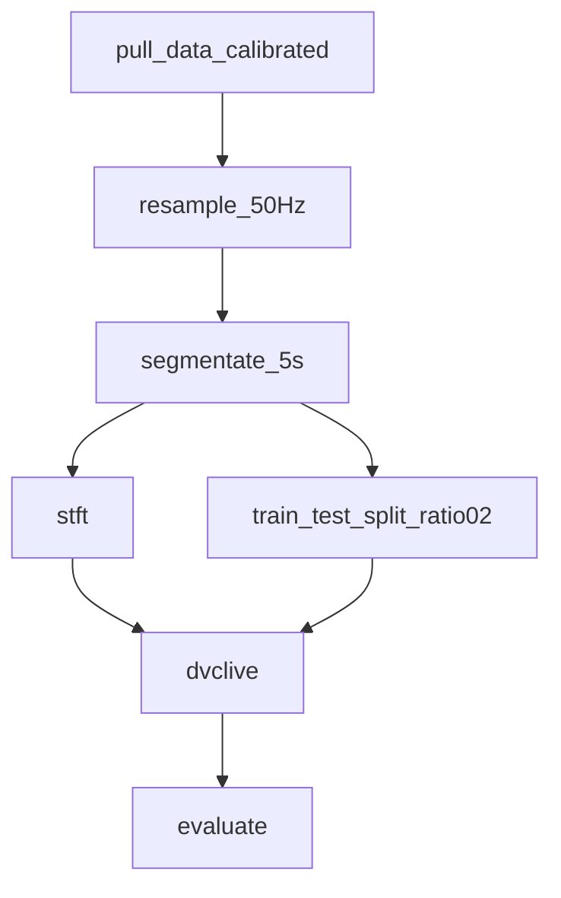
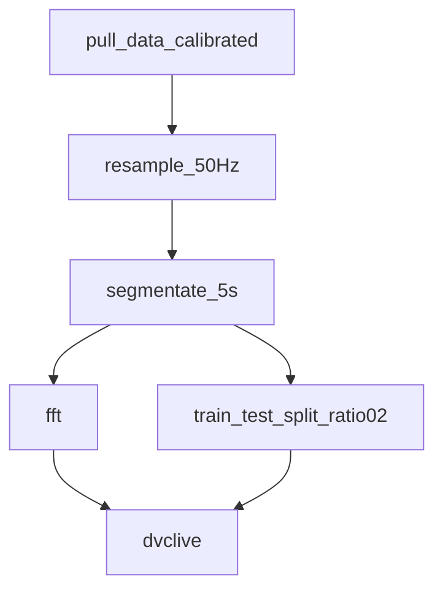

# CNN
The CNN is based on the paper by [Chen 2021](./recherche/Chen_2021.md). As described in the paper, we created spectrograms from the sensor data using the Short-Time Fourier Transform. We implemented the CNN using PyTorch and customized it a bit.

## DAG/Stages

The data is pulled from the database and then resampled to 50Hz. After that, it is split into 5 second windows. Then the train_test_split_ration02 marks 20% of the segments for testing and keeps the other 80% for the training. In the stft stage, the Spectrograms are created as described in the next section. The dvclive stage trains the model and the evaluate stage creates a confusion matrix to analyze the types errors the CNN makes. 

## Spectograms
The spectograms were created using `scipy.signal.stft`. The parameters are as follows:
- `fs`: Sampling rate we set to 50Hz (The same as it was set in the resample stage)
- `nperseg`: We have set the length of the segments to 100. This corresponds exactly to 2 seconds. 
- `noverlap`: We set the overlap of the segments to 95. This corresponds to an overlap of 95% or 1.9 seconds.

A spectogram then looks like this:

## CNN
The model architecture consists of four convolutional layers each followed by pooling layers. After the convolution part, a global average pooling layer and two fully connected layers follow. Here's a breakdown of the model:

- Convolutional Layer 1: Takes input with 9 channels, applies 32 filters of size 5x5.
- Pooling Layer 1: Performs max pooling with a kernel size of 2x2 and stride of 2.
- Convolutional Layer 2: Takes the output of the previous layer (32 channels) and applies 64 filters of size 4x4.
- Pooling Layer 2: Performs max pooling with a kernel size of 2x2 and stride of 2.
- Convolutional Layer 3: Takes the output of the previous layer (64 channels) and applies 128 filters of size 3x3.
- Pooling Layer 3: Performs max pooling with a kernel size of 2x2 and stride of 2.
- Convolutional Layer 4: Takes the output of the previous layer (128 channels) and applies 256 filters of size 2x2.
- Global Average Pooling Layer: Computes the average value of each channel across the spatial dimensions, resulting in a single value per channel.
- Fully Connected Layer 1: Takes the output of the global average pooling layer (128 features) and maps it to 64 features.
- Fully Connected Layer 2: Takes the output of the previous layer (64 features) and applies a softmax function to produce the final output.

### Model Parameters
Here's a summary of the trainable parameters in the model:

|  Name  |      Type          | Params |
|--------|:-----------------:|-------:|
| conv1             |  Conv2d             |  7.2 K |
| conv2             |  Conv2d             | 32.8 K |
| conv3             |  Conv2d             | 73.9 K |
| fc1               |  Linear             |  8.3 K |
| fc2               |  Sequential         |   390  |

Total params: 122 K

## Results
The model achieves a Performance of over 90% on the test set on the Accuracy. Here are the results:

|     Test metric    |        DataLoader 0         |
|:------------------:|----------------------------:|
|  test_acc_epoch    |     0.922       |
|  test_f1_epoch     |     0.915       |

CML Report: https://github.com/Sensor-Based-Activity-Recognition/pipelines/pull/98#issuecomment-1564147778

# MLP
The MLP is a simple, self-made model, we used as a placeholder. For this model we use the same spectrograms we used with the CNN model.

## DAG/Stages
We used the same Stages as in the CNN model.

## MLP
The model architecture consists of three fully connected linear layers. Here's a breakdown of the model:

- Flattener: Flattens the STFT and all 9 Channels into an array.
- Linear Layer 1: Takes the flattened array and maps it into an output array of 500.
- Linear Layer 2: Takes the array of 500 and maps it into an output array of 100.
- Linear Layer 3: Takes the array of 100 and maps it into an output array of 6.

### Model Parameters
Here's a summary of the trainable parameters in the model:

| Name     | Type               | Params
|----------|:------------------:|---------------:|
| fc1      | Linear             | 11.7 M         |
| fc2      | Linear             | 50.1 K         |
| fc3      | Linear             | 606            |

Total params: 11.8 M

## Results
The model achieves a very Bad performance and isn't considered for future use, since we have a better Deep Learning Model.

|     Test metric    |        DataLoader 0         |
|:------------------:|----------------------------:|
|  test_acc_epoch    |     0.229       |
|  test_f1_epoch     |     0.062       |

# HistGradientBoostingClassifier
This model uses the **HistGradientBoostingClassifier** from sklearn `sklearn.ensemble.HistGradientBoostingClassifier`.

## Features
As an input for out processing pipeline, we are using following features (All features share the same timestamp):
- Accelerometer X axis (uncalibrated)
- Accelerometer Y axis (uncalibrated)
- Accelerometer Z axis (uncalibrated)
- Gyroscope X axis (uncalibrated)
- Gyroscope Y axis (uncalibrated)
- Gyroscope Z axis (uncalibrated)
- Magnetometer X axis (uncalibrated)
- Magnetometer Y axis (uncalibrated)
- Magnetometer Z axis (uncalibrated)

Afterwards the observations (consisting from a timestamp and all features above) are resampled with a linear interpolation to 50Hz.

Next, each recording is split into 5s segments.

Finally, for each semgent, each feature is projected into the frequency spectrum space.

Stepping forward in the pipeline, a train test split is performed (train: random 80% of all segments, test: random 20% of all segments)

Before training the model, the features are stacked column wise, transforming each segment to a single row. All rows are stacked to matrix which will be fed into the model.

## DAG/Stages

## Results
The model achieves a Performance of over 98% on the test set on the Accuracy. Here are the results:

|     Test metric    |        Test Data         |
|:------------------:|----------------------------:|
|  test_acc_epoch    |     0.98525       |
|  test_f1_epoch     |     0.98363       |

CML Report: https://github.com/Sensor-Based-Activity-Recognition/pipelines/pull/99#issuecomment-1564102269
